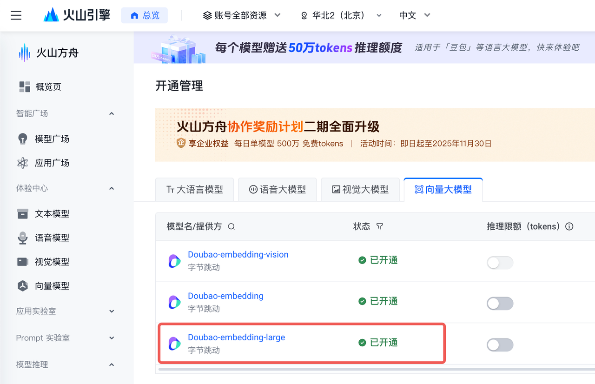

<div align="center">

<picture>
  
</picture>

### MineContext：Create with Context,Clarity from Chaos

An open-source,proactive context-aware AI partner,dedicated to bringing clarity and efficiency to your work, study and creation.

[中文](README_zh.md) / English


 <a href="https://bytedance.larkoffice.com/wiki/Hn6ewRnAwiSro7kkH6Sc1DMFnng">Community Best Practice</a> · <a href="https://github.com/volcengine/MineContext/issues">Report Issues</a> · <a href="https://bytedance.larkoffice.com/share/base/form/shrcnPAjJtlufuhBZGegll41NOh">Feedback</a>

[![][release-shield]][release-link]
[![][github-stars-shield]][github-stars-link]
[![][github-issues-shield]][github-issues-shield-link]
[![][github-contributors-shield]][github-contributors-link]
[![][license-shield]][license-shield-link]  
[![][last-commit-shield]][last-commit-shield-link]
[![][wechat-shield]][wechat-shield-link]


<a href="https://trendshift.io/repositories/15157" target="_blank"></a>


👋 Join our [WeChat / Lark / Red Note Group](https://bytedance.larkoffice.com/wiki/Hg6VwrxnTiXtWUkgHexcFTqrnpg)

🌍 Join our [Discord Group](https://discord.gg/tGj7RQ3nUR)

[App Download for Mac](https://github.com/volcengine/MineContext/releases/download/0.1.2/MineContext-0.1.2.dmg)


</div>

Table of Contents

- [👋🏻 What is MineContext](#-what-is-minecontext)
- [🚀 Key Features](#-key-features)
- [🔏 Privacy Protection](#-privacy-protection)
  - [Local-First](#local-first)
  - [Local AI model](#local-ai-model)
- [🏁 Quick Start](#-quick-start)
  - [1. Installation](#1-installation)
  - [2. Disable the quarantine attribute](#2-disable-the-quarantine-attribute)
  - [3. Enter Your API Key](#3-enter-your-api-key)
  - [4. Start Recording](#4-start-recording)
  - [5. Forget it](#5-forget-it)
  - [6. Backend Debugging](#6-backend-debugging)
- [🎃 Contribution Guide](#-contribution-guide)
  - [🎨 Frontend Architecture](#-frontend-architecture)
    - [Core Tech Stack](#core-tech-stack)
    - [Core Architecture](#core-architecture)
  - [💻 Frontend Usage](#-frontend-usage)
    - [Build Backend](#build-backend)
    - [Install Dependencies](#install-dependencies)
    - [Development and Debugging](#development-and-debugging)
    - [Application Packaging](#application-packaging)
  - [🏗️ Backend Architecture](#️-backend-architecture)
    - [Core Architecture Components](#core-architecture-components)
    - [Layer Responsibilities](#layer-responsibilities)
  - [🚀 Backend Usage](#-backend-usage)
    - [Installation](#installation)
    - [Configuration](#configuration)
    - [Running the Server](#running-the-server)
- [💎 The Philosophy Behind the Name](#-the-philosophy-behind-the-name)
- [🎯 Target User](#-target-user)
- [🔌 Context-Source](#-context-source)
- [🆚 Comparison with Familiar Application](#-comparison-with-familiar-application)
  - [MineContext vs ChatGPT Pulse](#minecontext-vs-chatgpt-pulse)
  - [MineContext vs Dayflow](#minecontext-vs-dayflow)
- [👥 Community](#-community)
  - [Community and Support](#community-and-support)
- [Star History](#star-history)
- [📃 License](#-license)

<br>

# 👋🏻 What is MineContext

MineContext is a proactive context-aware AI partner. By utilizing screenshots and content comprehension (with future support for multi-source multimodal information including documents, images, videos, code, and external application data), it can see and understand the user's digital world context. Based on an underlying contextual engineering framework, it actively delivers high-quality information such as insights, daily/weekly summaries, to-do lists, and activity records.


# 🚀 Key Features

MineContext focuses on four key features: effortless collection, intelligent resurfacing, proactive delivery, and a context engineering architecture.

1. 📥 Effortless Collection
   Capable of gathering and processing massive amounts of context. Designed storage management enables extensive collection without adding mental burden.
2. 🚀 Proactive Delivery
   Delivers key information and insights proactively in daily use. It extracts summarized content from your context—such as daily/weekly summaries, tips, and todos—and pushes them directly to your homepage.
3. 💡 Intelligent Resurfacing
   Surfaces relevant and useful context intelligently during creation. Ensures assisted creativity without overwhelming you with information.
4. 🎯 Context Engineering Architecture
   Supports the complete lifecycle of multimodal, multi-source data—from capture, processing, and storage to management, retrieval, and consumption—enabling the generation of six types of intelligent context.


# 🔏 Privacy Protection

##  Local-First
MineContext places a high priority on user privacy. By default, all data is stored locally in the following path to ensure your privacy and security.


```
~/Library/Application Support/MineContext/Data
```

## Local AI model 
In addition, we support custom model services based on the OpenAI API protocol. You can use fully local models in MineContext, ensuring that any data does not leave your local environment.

# 🏁 Quick Start

## 1. Installation

Click [Github Latest Release](https://github.com/volcengine/MineContext/releases) to Download


## 2. Disable the quarantine attribute

Enter the following command in the terminal to disable the quarantine attribute before running the application.

```
sudo xattr -d com.apple.quarantine "/Applications/MineContext.app"
```


## 3. Enter Your API Key

After the application launches, please follow the prompts to enter your API key. (Note: On the first run, the application needs to install the backend environment, which may take about two minutes).

We currently support services from Doubao, OpenAI, and custom models. This includes any **local models** or **third-party model** services that are compatible with the OpenAI API format.

We recommend using [LMStudio](https://lmstudio.ai/) to run local models. It provides a simple interface and powerful features to help you quickly deploy and manage them.

**Considering both cost and performance, we recommend using the Doubao model.** The Doubao API Key can be generated in the [API Management Interface](https://console.volcengine.com/ark/region:ark+cn-beijing/apiKey).

After obtaining the Doubao API Key, you need to activate two models in the [Model Activation Management Interface](https://console.volcengine.com/ark/region:ark+cn-beijing/model): the Visual Language Model and the Embedding Model.

- Visual Language Model: Doubao-Seed-1.6-flash
  

- Embedding Model: Doubao-embedding-large
  

The following is the filling process after obtaining the API Key:


## 4. Start Recording

Enter 【Screen Monitor】 to enable the system permissions for screen sharing. After completing the setup, you need to restart the application for the changes to take effect.


After restarting the application, please first set your screen sharing area in 【Settings】, then click [Start Recording] to begin taking screenshots.


## 5. Forget it

After starting the recording, your context will gradually be collected. It will take some time to generate value. So, forget about it and focus on other tasks with peace of mind. MineContext will generate to-dos, prompts, summaries, and activities for you in the background. Of course, you can also engage in proactive Q&A through [Chat with AI].
Of course, here is the English translation of the provided text:

## 6. Backend Debugging

MineContext supports backend debugging, which can be accessed at `http://localhost:8000`.

1.View Token Consumption and Usage


2.Configure Interval for Automated Tasks


3.Adjust System Prompt for Automated Tasks


# 🎃 Contribution Guide

## 🎨 Frontend Architecture

The MineContext frontend is a cross-platform desktop application built with Electron, React, and TypeScript, providing a modular, maintainable, and high-performance foundation for desktop development.

### Core Tech Stack

| Technology   | Description                                                                               |
| ------------ | ----------------------------------------------------------------------------------------- |
| Electron     | Allows for the development of cross-platform desktop applications using web technologies. |
| React        | A component-based UI library for building dynamic user interfaces.                        |
| TypeScript   | Provides static type checking to enhance code maintainability.                            |
| Vite         | A modern frontend build tool optimized for Electron.                                      |
| Tailwind CSS | A utility-first CSS framework for rapid and consistent UI styling.                        |
| pnpm         | A fast and efficient package manager suitable for monorepo projects.                      |

### Core Architecture

The project follows a standard Electron architectural design, clearly separating the code for the main process, preload scripts, and renderer process to ensure security and maintainability.

```
frontend/
├── src/
│ ├── main/     # Electron main process (window management, lifecycle, IPC)
│ ├── preload/  # Preload script, securely bridging Node APIs and the renderer process
│ └── renderer/ # React frontend interface (renderer process)
│
├── packages/
│ └── shared/   # Common utilities, IPC channels, logging, and constant definitions
│
├── build/      # Build resources (icons, platform configurations)
├── dist/       # Build artifacts generated by electron-builder
├── externals/  # External dependencies (Python scripts, binaries, etc.)
├── resources/  # Static assets (icons, templates, images)
└── scripts/    # Development and build helper scripts
```

1.  **Main Process (`src/main/`) is responsible for:**

    - Managing application windows
    - Handling lifecycle events (startup, quit, activate)
    - Establishing secure IPC communication
    - Integrating with backend services (Python and system APIs)

2.  **Preload Script (`src/preload/`) is responsible for:**

    - Securely exposing Node.js APIs to the renderer process
    - Handling IPC communication with the main process
    - Implementing cross-process resource access

3.  **Renderer Process (`src/renderer/`) is responsible for:**

    - Implementing the user interface with React
    - Managing global state with Jotai and Redux
    - Utilizing an efficient styling system based on Tailwind CSS
    - Implementing dynamic loading and performance optimization mechanisms

4.  **Build and Packaging are responsible for:**

    - `electron-vite.config.ts` — Configures the build logic for both the main and renderer processes (aliases, plugins, etc.).
    - `electron-builder.yml` — Defines packaging and distribution configurations for Windows, macOS, and Linux.

## 💻 Frontend Usage

### Build Backend

Before starting frontend development, you need to build the backend first:

```bash
uv sync
source .venv/bin/activate
./build.sh
```

### Install Dependencies

Due to package version issues, using a domestic PyPI mirror is not currently supported. Please run the following command to ensure you are using the original PyPI source:

```bash
pip config unset global.index-url
cd frontend
pnpm install
```

### Development and Debugging

During local development, it is normal for the screen capture area selection to be slow. Please wait, as this issue does not exist in the packaged application.

```bash
pnpm dev
```

### Application Packaging

To build APP for macOS:

```bash
pnpm build:mac
# Data Path
# ～/Library/Application\ Support/MineContext
```

The executable files generated by the packaging process will be stored in the `MineContext/frontend/dist` directory.

## 🏗️ Backend Architecture

MineContext adopts a modular, layered architecture design with clear separation of concerns and well-defined responsibilities for each component.

### Core Architecture Components

```
opencontext/
├── server/             # Web server and API layer
├── managers/           # Business logic managers
├── context_capture/    # Context acquisition modules
├── context_processing/ # Context processing pipeline
├── context_consumption/# Context consumption and generation
├── storage/            # Multi-backend storage layer
├── llm/               # LLM integration layer
├── tools/             # Tool system
└── monitoring/        # System monitoring
```

### Layer Responsibilities

1. **Server Layer** (`server/`)

   - FastAPI-based RESTful API
   - WebSocket support for real-time communication
   - Static file serving and template rendering

2. **Manager Layer** (`managers/`)

   - `CaptureManager`: Manages all context capture sources
   - `ProcessorManager`: Coordinates context processing pipeline
   - `ConsumptionManager`: Handles context consumption and generation
   - `EventManager`: Event-driven system coordination

3. **Context Capture Layer** (`context_capture/`)

   - Screenshot monitoring
   - Document monitoring
   - Extensible capture interface for future sources

4. **Processing Layer** (`context_processing/`)

   - Document chunking strategies
   - Entity extraction and normalization
   - Context merging and deduplication
   - Multi-modal content processing (text, images)

5. **Storage Layer** (`storage/`)

   - Multi-backend support (SQLite, ChromaDB)
   - Vector storage for similarity search
   - Unified storage interface

6. **LLM Integration** (`llm/`)

   - Support for multiple LLM providers (OpenAI, Doubao)
   - VLM (Vision-Language Model) integration
   - Embedding generation services

## 🚀 Backend Usage

### Installation

We recommend using [uv](https://docs.astral.sh/uv/) for fast and reliable package management:

```bash
# Clone repository
git clone https://github.com/volcengine/MineContext.git
cd MineContext

# Install uv (if not already installed)
curl -LsSf https://astral.sh/uv/install.sh | sh

# Sync dependencies (automatically creates virtual environment)
uv sync
```

### Configuration

1. **Basic Configuration** (`config/config.yaml`):

```yaml
server:
  host: 127.0.0.1
  port: 8765
  debug: false

embedding_model:
  provider: doubao # options: openai, doubao
  api_key: your-api-key
  model: doubao-embedding-large-text-240915

vlm_model:
  provider: doubao # options: openai, doubao
  api_key: your-api-key
  model: doubao-seed-1-6-flash-250828

capture:
  enabled: true
  screenshot:
    enabled: true # enable screenshot capture
    capture_interval: 5 # capture interval in seconds
```

2. **Prompt Templates** (`config/prompts_*.yaml`):
   - `prompts_en.yaml`: English prompt templates
   - `prompts_zh.yaml`: Chinese prompt templates

### Running the Server

```bash
# Start with default configuration
uv run opencontext start

# Start with custom config
uv run opencontext start --config /path/to/config.yaml

# Start with custom port (useful for avoiding conflicts)
uv run opencontext start --port 8000
```

**Available Options:**

- `--config`: Path to configuration file
- `--host`: Host address (default: from config or `localhost`)
- `--port`: Port number (default: from config or `8000`)

**Priority**: Command-line arguments > Config file > Default values

Alternatively, you can activate the virtual environment manually:

```bash
source .venv/bin/activate  # On Windows: .venv\Scripts\activate
pip install -e .
opencontext start --port 8000
```

# 💎 The Philosophy Behind the Name

The naming of MineContext also reflects the team's ingenuity. It signifies both "my context" and "mining context." It draws inspiration from the core philosophy of Minecraft—openness, creativity, and exploration.

If vast amounts of context are like scattered "blocks," then MineContext provides a "world" where you can freely build, combine, and create. Users can reimagine and create new content based on the collected massive context and generate high-quality information.

# 🎯 Target User

| Target User Category | Specific Roles/Identities          | Core Needs/Pain Points                                                                                   |
| -------------------- | ---------------------------------- | -------------------------------------------------------------------------------------------------------- |
| Knowledge Workers    | Researchers, Analysts              | Navigating vast amounts of information, improving information processing and analysis efficiency         |
| Content Creators     | Writers, Bloggers                  | Craving endless inspiration, optimizing content creation workflows                                       |
| Lifelong Learners    | Students, Researchers              | Building systematic knowledge systems, efficiently managing and connecting learning materials            |
| Project Managers     | Product Managers, Project Managers | Integrating multi-source information and data, ensuring project alignment and decision-making efficiency |

# 🔌 Context-Source

We will prioritize the expansion of Context Sources according to the following plan, and we warmly welcome everyone to actively contribute code to our efforts.

- P0: Digital life and public information loop (PC screen capture and link upload)
- P1: Personal text context loop (file upload, file tracking)
- P2: AI and common office context loop (MCP, meeting notes)
- P3: High-quality information acquisition loop (DeepResearch and RSS)
- P4: Personal deep context loop (WeChat, QQ chat data acquisition, mobile screenshots)
- P5: Physical world context loop (smart wearable synchronization, smart glasses synchronization)

| Context Capture Capability   | Context Source                            | Priority | Completion Status |
| :--------------------------- | :---------------------------------------- | :------- | :---------------- |
| Screen Screenshot            | User PC Information                       | P0       | ✅                |
| Note Editing                 | Application Internal Creation Information | P0       | ✅                |
| Link Upload                  | Internet Information                      | P0       |                   |
| File Upload                  | Structured Documents                      | P1       |                   |
| File Upload                  | Unstructured Documents                    | P1       |                   |
| File Upload                  | Images                                    | P1       |                   |
| File Upload                  | Audio                                     | P4       |                   |
| File Upload                  | Video                                     | P4       |                   |
| File Upload                  | Code                                      | P4       |                   |
| Browser Extension            | AI Conversation Records                   | P2       |                   |
| Browser Extension            | Refined Internet Information              | P5       |                   |
| Meeting Records              | Meeting Information                       | P2       |                   |
| RSS                          | Consultation Information                  | P3       |                   |
| Deep Research                | High-Quality Research Analysis            | P3       |                   |
| Application MCP/API          | Payment Records                           | P4       |                   |
| Application MCP/API          | Research Papers                           | P3       |                   |
| Application MCP/API          | News                                      | P4       |                   |
| Application MCP/API          | Emails                                    | P4       |                   |
| Application MCP/API          | Notion                                    | P2       |                   |
| Application MCP/API          | Obsidian                                  | P2       |                   |
| Application MCP/API          | Slack                                     | P4       |                   |
| Application MCP/API          | Jira                                      | P4       |                   |
| Application MCP/API          | Figma                                     | P2       |                   |
| Application MCP/API          | Linear                                    | P4       |                   |
| Application MCP/API          | Todoist                                   | P4       |                   |
| Memory Bank Migration Import | User Memory                               | P4       |                   |
| WeChat Data Capture          | WeChat Chat History                       | P4       |                   |
| QQ Data Capture              | QQ Chat History                           | P4       |                   |
| Mobile Screenshot Monitor    | User Mobile End Information               | P4       |                   |
| Smart Glasses Data Sync      | Physical World Interaction Records        | P5       |                   |
| Smart Bracelet Data Sync     | Physiological Data                        | P5       |                   |

# 🆚 Comparison with Familiar Application

## MineContext vs ChatGPT Pulse

- 🖥️ Comprehensive Digital Context:
  MineContext captures your entire digital workflow by reading from screen screenshots, providing a rich, visual context of your daily activities and applications. ChatGPT Pulse, in contrast, is limited to the context of a single text-based conversation.
- 🔒 Local-First Data & Privacy:
  Your data is processed and stored entirely on your local device, ensuring complete privacy and security without relying on cloud servers. ChatGPT Pulse requires data to be sent to and stored on OpenAI's servers.
- 🚀 Proactive & Diverse Insights:
  MineContext delivers a wider variety of intelligent, auto-generated content—including daily summaries, actionable todos, and activity reports—not just simple tips. ChatGPT Pulse primarily offers reactive assistance within the chat interface.
- 🔧 Open Source & Customizable:
  As an open-source project, MineContext allows developers to freely inspect, modify, and build upon the codebase for complete customization. ChatGPT Pulse is a closed, proprietary product with no option for modification.
- 💰 Cost-Effective API Usage:
  MineContext avoids the need for a costly $200/month Pro subscription by allowing you to use your own API key, giving you full control over your spending. ChatGPT Pulse's advanced features are locked behind its expensive premium tier.

## MineContext vs Dayflow

- 💡 Richer, Proactive Insights:
  ineContext delivers a more diverse range of automated, intelligent content—including concise summaries, actionable todos, and contextual tips—going beyond basic activity tracking. DayFlow primarily focuses on logging user activity.
- 🧠 Context-Aware Q&A & Creation:
  MineContext enables you to ask questions and generate new content based on your captured context, unlocking wider application scenarios like content drafting and project planning. DayFlow is limited to passive activity recording and review.
- ✨ Superior Activity Generation & Experience:
  MineContext produces activity records with greater clarity and detail, featuring a more intuitive and interactive dashboard for a seamless user experience. DayFlow's activity logs are more basic with limited interactivity.

<br>

# 👥 Community

## Community and Support

- [GitHub Issues](https://github.com/volcengine/MineContext/issues): Errors and issues encountered while using MineContext.
- [Email Support](mailto:minecontext@bytedance.com): Feedback and questions about using MineContext.
- <a href="https://bytedance.larkoffice.com/wiki/Hg6VwrxnTiXtWUkgHexcFTqrnpg">WeChat Group</a>: Discuss SwanLab usage and share the latest AI technologies.

# Star History

[](https://www.star-history.com/#volcengine/MineContext&Timeline)

# 📃 License

This repository is licensed under the Apache 2.0 License.

<!-- link -->

[release-shield]: https://img.shields.io/github/v/release/volcengine/MineContext?color=369eff&labelColor=black&logo=github&style=flat-square
[release-link]: https://github.com/volcengine/MineContext/releases
[license-shield]: https://img.shields.io/badge/license-apache%202.0-white?labelColor=black&style=flat-square
[license-shield-link]: https://github.com/volcengine/MineContext/blob/main/LICENSE
[last-commit-shield]: https://img.shields.io/github/last-commit/volcengine/MineContext?color=c4f042&labelColor=black&style=flat-square
[last-commit-shield-link]: https://github.com/volcengine/MineContext/commits/main
[wechat-shield]: https://img.shields.io/badge/WeChat-微信-4cb55e?labelColor=black&style=flat-square
[wechat-shield-link]: https://bytedance.larkoffice.com/wiki/Hg6VwrxnTiXtWUkgHexcFTqrnpg
[github-stars-shield]: https://img.shields.io/github/stars/volcengine/MineContext?labelColor&style=flat-square&color=ffcb47
[github-stars-link]: https://github.com/volcengine/MineContext
[github-issues-shield]: https://img.shields.io/github/issues/volcengine/MineContext?labelColor=black&style=flat-square&color=ff80eb
[github-issues-shield-link]: https://github.com/volcengine/MineContext/issues
[github-contributors-shield]: https://img.shields.io/github/contributors/volcengine/MineContext?color=c4f042&labelColor=black&style=flat-square
[github-contributors-link]: https://github.com/volcengine/MineContext/graphs/contributors
