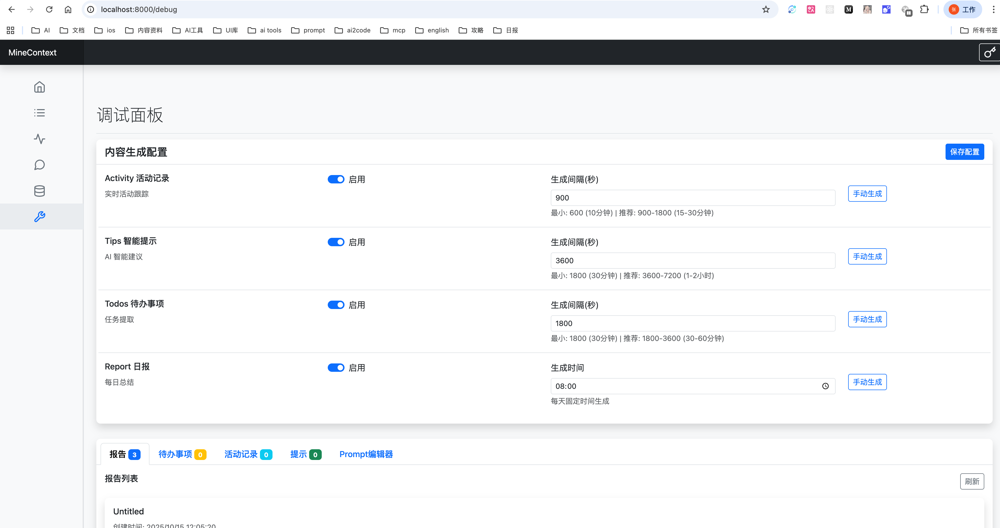

<div align="center">

<picture>
  
</picture>

### MineContext：洞察本质，激发创造

一个开源、主动的上下文感知 AI 伙伴，致力于让您的工作、学习与创作更加清晰高效。

<a href="https://github.com/volcengine/MineContext/issues">反馈问题</a> · <a href="https://bytedance.larkoffice.com/share/base/form/shrcn2wgAfiyCVVwhvVYCXWNNdc">提交问卷</a>

[![][release-shield]][release-link]
[![][github-stars-shield]][github-stars-link]
[![][github-issues-shield]][github-issues-shield-link]
[![][github-contributors-shield]][github-contributors-link]
[![][license-shield]][license-shield-link]  
[![][last-commit-shield]][last-commit-shield-link]
[![][wechat-shield]][wechat-shield-link]

中文 / [English](README.md)

👋 加入我们的 [微信 / 飞书 / 小红书交流群](https://bytedance.larkoffice.com/wiki/Hg6VwrxnTiXtWUkgHexcFTqrnpg)

🌍 加入我们的 [Discord 社区](https://discord.gg/tGj7RQ3nUR)

[Mac 应用下载](https://github.com/volcengine/MineContext/releases/download/0.1.1/MineContext-0.1.1.dmg)

</div>

目录

- [👋🏻 MineContext 是什么](#-minecontext是什么)
- [🚀 核心功能](#-核心功能)
- [🏁 快速开始](#-快速开始)
  - [1. 安装](#1-安装)
  - [2. 禁用隔离属性](#2-禁用隔离属性)
  - [3. 输入您的 API 密钥](#3-输入您的api密钥)
  - [4. 开始记录](#4-开始记录)
  - [5. 忘掉它](#5-忘掉它)
- [🎃 贡献指南](#-贡献指南)
  - [🎨 前端架构](#-前端架构)
    - [核心技术栈](#核心技术栈)
    - [核心架构](#核心架构)
  - [💻 前端使用](#-前端使用)
    - [安装依赖](#安装依赖)
    - [开发调试](#开发调试)
    - [应用打包](#应用打包)
  - [🏗️ 后端架构](#️-后端架构)
    - [核心架构组件](#核心架构组件)
    - [各层职责](#各层职责)
  - [🚀 后端使用](#-后端使用)
    - [安装](#安装)
    - [配置](#配置)
    - [运行服务器](#运行服务器)
- [💎 MineContext 与我的世界](#-minecontext与我的世界)
- [🎯 目标用户](#-目标用户)
- [🔌 上下文来源](#-上下文来源)
- [🆚 与同类应用的比较](#-与同类应用的比较)
  - [MineContext vs ChatGPT Pulse](#minecontext-vs-chatgpt-pulse)
  - [MineContext vs Dayflow](#minecontext-vs-dayflow)
- [👥 社区](#-社区)
  - [社区与支持](#社区与支持)
- [Star History](#star-history)
- [📃 许可证](#-许可证)

## 👋🏻 MineContext 是什么

MineContext 是一个具有上下文感知能力的主动式 AI 伙伴。它基于屏幕截图+内容理解的方式（未来还将支持其他来源的多模态信息，包括文档、图片、视频、代码、外部应用数据），能够看到并看懂用户的数字世界上下文，然后再基于底层的上下文工程框架，主动推送洞察、日/周总结 、待办、活动记录等高质量信息，同时支持用户基于 Context 和生成的信息进行再创作。


## 🚀 核心功能

MineContext 专注于五个核心功能：轻松收集、智能重显和主动交付。

1. 📥 无感收集
   支持收集和处理海量的 Context，并通过设计存储管理来实现海量收集却没有心智负担。
2. 🚀 主动推送
   支持日常主动推送关键信息和洞见，能够提炼 Context 中的总结信息，比如每日总结，每周总结，tips，todo，主动推送到主页。
3. 💡 智能浮现
   支持创作时智能浮现，可以随时浮现相关有用的 Context，确保辅助创作又不会被淹没
4. 🛡️ 隐私优先
   所有数据都保存在本地，确保您的隐私和安全。
5. 🎯 上下文工程架构
   支持多模态、多源数据的完整生命周期——从捕获、处理和存储到管理、检索和消费——支持生成六种类型的智能上下文。

## 🏁 快速开始

### 1. 安装

点击 [Github Latest Release](https://github.com/volcengine/MineContext/releases) 下载最新版本。


### 2. 禁用隔离属性

在运行应用程序之前，在终端中输入以下命令以禁用隔离属性。

```
sudo xattr -d com.apple.quarantine "/Applications/MineContext.app"
```


### 3. 输入您的 API 密钥

应用程序启动后（首次运行时需要安装后端环境，约需等待两分钟），请根据引导输入您的 API 密钥。目前我们支持豆包、OpenAI 以及自定义模型服务，包括任何兼容 OpenAI API 格式的**本地模型**或**第三方模型**服务。
我们推荐使用[LMStudio](https://lmstudio.ai/)来运行本地模型，它提供了简单的界面和强大的功能，能够帮助您快速部署和管理本地模型。

**综合成本和性能，我们推荐使用豆包模型**，豆包模型的 API-Key 可以在[API 管理界面](https://console.volcengine.com/ark/region:ark+cn-beijing/apiKey)生成。

获取豆包 API 之后需要在[模型开通管理界面](https://console.volcengine.com/ark/region:ark+cn-beijing/model)开通视觉语言模型和向量化两个模型。

- 视觉语言模型: Doubao-Seed-1.6-flash
  

- 向量化模型: Doubao-embedding-large
  

以下是获取了 API Key 后的填写流程:


### 4. 开始记录

进入【Screen Monitor】启用屏幕分享的系统权限，设置完之后需要重新启动应用使其生效。


重新启动应用后，请先在【Settings】设置您的屏幕共享区域，然后点击【Start Recording】开始截图。


### 5. 忘掉它

启动记录后，您的上下文将逐渐被收集。这会需要一些时间才能产生价值。所以说，忘记它，安心专注于其他任务吧。MineContext 将会在后台为您生成待办事项、提示、摘要和活动。当然，您也可以通过【Chat with AI】进行主动问答。

### 6. 后台调试

MineContext 支持在`http://localhost:8000` 进行后台调试。

1.支持查看 Token 用量与使用情况


2.支持主动推送任务的时间间隔设置



3.支持调整主动推送任务的系统提示词


## 🎨 前端架构

MineContext 前端 是一个基于 Electron、React 和 TypeScript 构建的 跨平台桌面应用程序，提供模块化、可维护且高性能的桌面开发基础。

### 核心技术栈

| 技术         | 描述                                          |
| ------------ | --------------------------------------------- |
| Electron     | 允许使用 Web 技术开发跨平台桌面应用程序。     |
| React        | 用于构建动态用户界面的基于组件的 UI 库。      |
| TypeScript   | 提供静态类型检查，增强代码可维护性。          |
| Vite         | 针对 Electron 优化的现代前端构建工具。        |
| Tailwind CSS | 用于快速且一致地设计 UI 的实用优先 CSS 框架。 |
| pnpm         | 适用于 monorepo 项目的快速高效的包管理器。    |

### 核心架构

该项目遵循 标准的 Electron 架构设计，将主进程、预加载脚本和渲染进程的代码清晰分离，以保证安全性和可维护性。

```
frontend/
├── src/
│ ├── main/ # Electron 主进程（窗口管理、生命周期、IPC 通信）
│ ├── preload/ # 预加载脚本，安全桥接 Node API 与渲染进程
│ └── renderer/ # React 前端界面（渲染进程）
│
├── packages/
│ └── shared/ # 通用工具、IPC 通道、日志与常量定义
│
├── build/ # 构建资源（图标、平台配置）
├── dist/ # 由 electron-builder 生成的构建产物
├── externals/ # 外部依赖（Python 脚本、二进制文件等）
├── resources/ # 静态资源（图标、模板、图片）
└── scripts/ # 开发与构建辅助脚本
```

1、主进程 (src/main/)负责：
• 管理应用窗口
• 处理生命周期事件（启动、退出、激活）
• 建立安全的 IPC 通信
• 与后端服务（Python 与系统 API）集成

2、预加载脚本 (src/preload/)负责：
• 安全地将 Node.js API 暴露给渲染进程
• 处理与主进程的 IPC 通信
• 实现跨进程的资源访问

3、渲染进程 (src/renderer/)负责：
• 实现基于 React 的用户界面
• 使用 Jotai 与 Redux 管理全局状态
• 基于 Tailwind CSS 的高效样式体系
• 动态加载与性能优化机制

4、构建与打包负责：
• electron-vite.config.ts — 同时配置主进程与渲染进程的构建逻辑（别名、插件等）。
• electron-builder.yml — 定义针对 Windows、macOS、Linux 的打包与分发配置。

## 💻 前端使用

### 安装依赖

由于包版本原因，目前不支持使用国内 PYPI 源，请输入以下命令，确保使用的是原始 PYPI 环境

```
pip config unset global.index-url
cd frontend
./start-dev.sh
```

### 开发调试

本地开发时，截屏范围获取较慢属于正常现象，等待即可，打包应用无此问题。

```
cd frontend
pnpm install
pnpm dev
```

💡 建议： 每次启动前端时优先使用 ./start-dev.sh，该脚本会确保 Node.js 使用稳定版本环境以及配置基础的运行环境。

### 应用打包

为不同平台构建可执行文件：

- macOS

```bash
pnpm build:mac
```

- Windows

```bash
pnpm build:win
```

- Linux

```bash
pnpm build:linux
```

打包生成的可执行文件会存放在`MineContext/frontend/dist`目录下。

## 🏗️ 后端架构

MineContext 采用模块化、分层的架构设计，各组件职责明确，关注点分离。

### 核心架构组件

```
opencontext/
├── server/             # Web服务器和API层
├── managers/           # 业务逻辑管理器
├── context_capture/    # 上下文获取模块
├── context_processing/ # 上下文处理流水线
├── context_consumption/# 上下文消费和生成
├── storage/            # 多后端存储层
├── llm/               # LLM集成层
├── tools/             # 工具系统
└── monitoring/        # 系统监控
```

### 各层职责

1. **服务器层** (`server/`)

   - 基于 FastAPI 的 RESTful API
   - 支持实时通信的 WebSocket
   - 静态文件服务和模板渲染

2. **管理器层** (`managers/`)

   - `CaptureManager`: 管理所有上下文捕获源
   - `ProcessorManager`: 协调上下文处理流水线
   - `ConsumptionManager`: 处理上下文消费和生成
   - `EventManager`: 事件驱动的系统协调

3. **上下文捕获层** (`context_capture/`)

   - 屏幕截图监控
   - 文档监控
   - 可扩展的捕获接口，支持未来的来源

4. **处理层** (`context_processing/`)

   - 文档分块策略
   - 实体提取和规范化
   - 上下文合并和去重
   - 多模态内容处理（文本、图像）

5. **存储层** (`storage/`)

   - 多后端支持（SQLite、ChromaDB）
   - 用于相似性搜索的向量存储
   - 统一的存储接口

6. **LLM 集成** (`llm/`)

   - 支持多个 LLM 提供商（OpenAI、豆包）
   - VLM（视觉-语言模型）集成
   - 嵌入生成服务

## 🚀 后端使用

### 安装

我们推荐使用 [uv](https://docs.astral.sh/uv/) 进行快速、可靠的包管理：

```bash
# 克隆仓库
git clone https://github.com/volcengine/MineContext.git
cd MineContext

# 安装 uv（如果尚未安装）
curl -LsSf https://astral.sh/uv/install.sh | sh

# 同步依赖（自动创建虚拟环境）
uv sync
```

### 配置

1. **基本配置** (`config/config.yaml`):

```yaml
server:
  host: 127.0.0.1
  port: 8765
  debug: false

embedding_model:
  provider: doubao # 选项: openai, doubao
  api_key: your-api-key
  model: doubao-embedding-large-text-240915

vlm_model:
  provider: doubao # 选项: openai, doubao
  api_key: your-api-key
  model: doubao-seed-1-6-flash-250828

capture:
  enabled: true
  screenshot:
    enabled: true # 开启截图捕获
    capture_interval: 5 # 截图间隔（秒）
```

2. **提示模板** (`config/prompts_*.yaml`):
   - `prompts_en.yaml`: 英文提示模板
   - `prompts_zh.yaml`: 中文提示模板

### 运行服务器

```bash
# 使用默认配置启动
uv run opencontext start

# 使用自定义配置启动
uv run opencontext start --config /path/to/config.yaml

# 使用自定义端口启动
uv run opencontext start --port 8000
```

**可用选项：**

- `--config`：配置文件路径
- `--host`：主机地址（默认：配置文件中的值或 `localhost`）
- `--port`：端口号（默认：配置文件中的值或 `8000`）

**优先级**：命令行参数 > 配置文件 > 默认值

或者，你也可以手动激活虚拟环境：

```bash
source .venv/bin/activate  # Windows系统: .venv\Scripts\activate
pip install -e .
opencontext start --port 8000
```

## 💎 MineContext 与我的世界

MineContext 的命名，也体现了团队的巧思。既是“我的上下文”，更要“挖掘上下文”。它借鉴了 MineCraft（我的世界）的核心理念——开放、创造与探索。

如果说海量的 Context 是散落各处的“方块”，那么 MineContext 提供的就是一个让你能够自由搭建、组合、创造的“世界”。用户除了接收到主动推送的信息外，还能够基于收集到的海量 Context 和生成的高质量信息进行再创作。

## 🎯 目标用户

| 目标用户类别 | 具体角色/身份      | 核心需求/痛点                                |
| ------------ | ------------------ | -------------------------------------------- |
| 知识工作者   | 研究人员、分析师   | 浏览海量信息，提高信息处理和分析效率         |
| 内容创作者   | 作家、博主         | 渴求无尽灵感，优化内容创作工作流程           |
| 终身学习者   | 学生、研究者       | 建立系统化知识体系，高效管理和连接学习材料   |
| 项目经理     | 产品经理、项目经理 | 整合多源信息和数据，确保项目一致性和决策效率 |

## 🔌 上下文来源

我们将按照以下计划优先扩展上下文来源，热烈欢迎大家积极贡献代码。

- P0: 数字生活和公共信息循环（PC 屏幕捕获和链接上传）
- P1: 个人文本上下文循环（文件上传、文件跟踪）
- P2: AI 和常见办公上下文循环（MCP、会议记录）
- P3: 高质量信息获取循环（DeepResearch 和 RSS）
- P4: 个人深度上下文循环（微信、QQ 聊天数据获取、手机截图）
- P5: 物理世界上下文循环（智能穿戴同步、智能眼镜同步）

| 上下文捕获能力   | 上下文来源       | 优先级 | 完成状态 |
| :--------------- | :--------------- | :----- | :------- |
| 屏幕截图         | 用户 PC 信息     | P0     | ✅       |
| 笔记编辑         | 应用内创作信息   | P0     | ✅       |
| 链接上传         | 互联网信息       | P0     |          |
| 文件上传         | 结构化文档       | P1     |          |
| 文件上传         | 非结构化文档     | P1     |          |
| 文件上传         | 图像             | P1     |          |
| 文件上传         | 音频             | P4     |          |
| 文件上传         | 视频             | P4     |          |
| 文件上传         | 代码             | P4     |          |
| 浏览器扩展       | AI 对话记录      | P2     |          |
| 浏览器扩展       | 提炼的互联网信息 | P5     |          |
| 会议记录         | 会议信息         | P2     |          |
| RSS              | 咨询信息         | P3     |          |
| Deep Research    | 高质量研究分析   | P3     |          |
| 应用 MCP/API     | 支付记录         | P4     |          |
| 应用 MCP/API     | 研究论文         | P3     |          |
| 应用 MCP/API     | 新闻             | P4     |          |
| 应用 MCP/API     | 电子邮件         | P4     |          |
| 应用 MCP/API     | Notion           | P2     |          |
| 应用 MCP/API     | Obsidian         | P2     |          |
| 应用 MCP/API     | Slack            | P4     |          |
| 应用 MCP/API     | Jira             | P4     |          |
| 应用 MCP/API     | Figma            | P2     |          |
| 应用 MCP/API     | Linear           | P4     |          |
| 应用 MCP/API     | Todoist          | P4     |          |
| 记忆库迁移导入   | 用户记忆         | P4     |          |
| 微信数据捕获     | 微信聊天历史     | P4     |          |
| QQ 数据捕获      | QQ 聊天历史      | P4     |          |
| 手机截图监控     | 用户移动端信息   | P4     |          |
| 智能眼镜数据同步 | 物理世界交互记录 | P5     |          |
| 智能手环数据同步 | 生理数据         | P5     |          |

## 🆚 与同类应用的比较

### MineContext vs ChatGPT Pulse

- 🖥️ 全面的数字世界上下文：
  MineContext 通过读取屏幕截图捕获您的整个数字工作流程，提供丰富的、可视化的日常活动和应用程序上下文。相比之下，ChatGPT Pulse 仅限于单个基于文本的对话上下文。
- 🔒 本地优先数据与隐私：
  您的数据完全在本地设备上处理和存储，确保完全的隐私和安全，无需依赖云服务器。ChatGPT Pulse 要求数据发送到并存储在 OpenAI 的服务器上。
- 🚀 更加多样化的主动推送：
  MineContext 提供更广泛的智能自动生成内容——包括每日摘要、可操作的待办事项和活动报告——而不仅仅是简单的提示。ChatGPT Pulse 仅在每天早上提供 5-10 个提示。
- 🔧 开源可定制：
  作为一个开源项目，MineContext 允许开发人员自由检查、修改和构建代码库，实现完全定制。ChatGPT Pulse 是一个封闭的专有产品，无法修改。
- 💰 经济实惠的 API 使用：
  MineContext 通过允许您使用自己的 API 密钥，避免了每月 200 美元的昂贵 Pro 订阅费用，让您完全控制支出。ChatGPT Pulse 的高级功能被锁定在其昂贵的高级订阅后面。

### MineContext vs Dayflow

- 💡 更丰富、更主动的洞察：
  MineContext 提供更多样化的自动智能内容——包括简明摘要、可操作的待办事项和上下文提示——超越基本的活动跟踪。DayFlow 仅记录用户活动。
- 🧠 上下文感知的问答与创作：
  MineContext 允许您基于捕获的上下文提问和生成新内容，解锁更广泛的应用场景，如内容起草和项目规划。DayFlow 仅限于被动的活动记录和回顾。
- ✨ 更优质的活动生成与体验：
  MineContext 生成的活动记录更加清晰和详细，具有更直观和交互式的仪表板，提供无缝的用户体验。DayFlow 的活动日志更基本，交互性有限。

## 👥 社区

### 社区与支持

- [GitHub Issues](https://github.com/volcengine/MineContext/issues)：使用 MineContext 时遇到的错误和问题。
- [邮件支持](mailto:minecontext@bytedance.com)：关于使用 MineContext 的反馈和问题。
- <a href="https://bytedance.larkoffice.com/wiki/Hg6VwrxnTiXtWUkgHexcFTqrnpg">微信群</a>：讨论 MineContext 使用并分享最新 AI 技术。

## Star History

[](https://www.star-history.com/#volcengine/MineContext&Timeline)

## 📃 许可证

本仓库在 Apache 2.0 许可证下发布。

<!-- link -->

[release-shield]: https://img.shields.io/github/v/release/volcengine/MineContext?color=369eff&labelColor=black&logo=github&style=flat-square
[release-link]: https://github.com/volcengine/MineContext/releases
[license-shield]: https://img.shields.io/badge/license-apache%202.0-white?labelColor=black&style=flat-square
[license-shield-link]: https://github.com/volcengine/MineContext/blob/main/LICENSE
[last-commit-shield]: https://img.shields.io/github/last-commit/volcengine/MineContext?color=c4f042&labelColor=black&style=flat-square
[last-commit-shield-link]: https://github.com/volcengine/MineContext/commits/main
[wechat-shield]: https://img.shields.io/badge/WeChat-微信-4cb55e?labelColor=black&style=flat-square
[wechat-shield-link]: https://bytedance.larkoffice.com/wiki/Hg6VwrxnTiXtWUkgHexcFTqrnpg
[github-stars-shield]: https://img.shields.io/github/stars/volcengine/MineContext?labelColor&style=flat-square&color=ffcb47
[github-stars-link]: https://github.com/volcengine/MineContext
[github-issues-shield]: https://img.shields.io/github/issues/volcengine/MineContext?labelColor=black&style=flat-square&color=ff80eb
[github-issues-shield-link]: https://github.com/volcengine/MineContext/issues
[github-contributors-shield]: https://img.shields.io/github/contributors/volcengine/MineContext?color=c4f042&labelColor=black&style=flat-square
[github-contributors-link]: https://github.com/volcengine/MineContext/graphs/contributors
