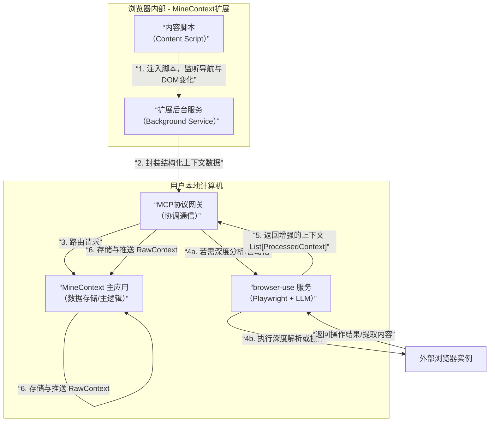

# MineCapture 方案
MineContext 当前阶段对于浏览器的信息采集主要是基于 screenshot + vlm 分析.
这种方式虽然通用，但存在明显问题：
1. 信息密度低且噪音大：截图包含大量冗余 UI 元素、无关内容例如网页footer, sidebar 广告 等等无关内容,这些内容不需要捕获,但截屏分析一股脑装进来,即增加了存储成本,也增加了模型理解成本,加大 token 消耗.
2. 上下文理解依赖强视觉模型：准确提取文本、理解结构（如表格、列表）成本高, token 消耗非常大.
3. 无法进行深度交互: 仅能"看", 不能"操作".

而基于 browser-use 的浏览器插件开发设计希望做到

* 精准数据采集：可直接获取网页的纯净HTML、结构化数据（JSON-LD）、文本内容, (与截图 + vlm 模型识别 方案对比, 优势: 数据精确+低成本)
* 理解页面结构与语义：通过DOM树，能天然理解元素的层次、角色（按钮、输入框）和交互逻辑。
* 实现主动服务闭环：不仅能“记录”你看了什么，未来还能“替你做”。例如，记录到你反复查看某航班比价页面，未来可授权它自动执行比价查询并推送结果，实现真正的“伙伴”级主动服务。


## 架构设计

核心思想如下图所示:



在这个架构中，各组件分工如下：

1. 浏览器扩展层：负责无感知的初始采集。
   1. 通过内容脚本监听页面导航、DOM变化，轻量级地捕获URL、标题、主要文本和用户交互事件。
   2. 当需要更深度的分析（如整个页面的知识图谱提取）或执行任务（如“帮我保存这篇文章”）时，它将请求通过MCP协议转发给本地服务。
2. 本地 browser-use 服务层。
   1. 收到扩展的请求后，可启动一个无头浏览器实例，精准导航到相同页面，利用其AI能力执行复杂的解析、总结、问答或自动化操作。
3. MineContext 主应用：作为数据中枢与呈现层。接收来自扩展的原始上下文和来自 browser-use 服务的增强型分析结果，进行统一存储、索引和管理。并基于这些丰富的上下文，生成高质量的日报、周报、待办事项和主动洞察。

## 实现方案

1. 基础框架：
   1. 浏览器扩展:
   其内容脚本使用 MutationObserver 监听页面主要内容区域的变化
   2. opencontext:
   负责与本地 MCP服务器 建立 WebSocket 长连接。数据格式设计为：
     ```json
     {
       "type": "page_context",
       "url": "...",
       "title": "...",
       "timestamp": "...",
       "simple_text": "...",
       "action": "summarize" // 或 "extract_links", "save_to_notion"
     }
     ```
     
2. 集成 browser-use 作为 MCP 服务器：
   · 这正是 mcp-browser-use 项目（）所解决的问题。你可以直接使用或参考它，将 browser-use 的能力（导航、点击、提取、执行JS）封装成标准的MCP工具。
   · 在MineContext本地主应用中，集成这个MCP客户端。当扩展发来一个 {"action": "summarize"} 的请求时，主应用通过MCP协议调用 browser-use 工具，对目标URL进行深度访问和总结。
3. 实现上下文增强与任务自动化：
   · 增强采集：对于重要的文章页或文档页，扩展可触发 browser-use 进行深度解析，提取核心论点、参考文献、数据表格等，形成远超截图的优质上下文。
   · 任务自动化：用户可以通过与MineContext的对话界面（如“帮我把这篇文章的要点保存到我的笔记里”），触发一个由 browser-use 执行的自动化工作流：导航到文章页->提取要点->打开笔记网站->填写并提交。这实现了从“记录”到“执行”的跨越。

四、 挑战与前瞻

1. 性能与复杂度：为每个标签页维持完整的 browser-use 实例开销巨大。必须采用按需启动、池化管理、任务队列等策略，确保资源占用可控。
2. 权限与安全：浏览器扩展权限与本地自动化能力的结合，力量强大也意味着风险。必须设计明确的用户授权机制（例如“是否允许MineContext自动为您填写表单？”），并且所有操作都应可审计、可撤销。
3. 与 MineContext 开源路线的协同：MineContext的底层框架未来将开源为 OpenContext。基于 browser-use 的扩展开发，完全可以遵循OpenContext的架构规范，使其成为一个专注于“浏览器上下文捕获与交互”的插件模块，贡献到其开源生态中。

结论：将 browser-use 作为 MineContext 浏览器扩展开发的基点，不仅在技术上完全可行，而且是实现其“主动式上下文感知伙伴”愿景的强力助推器。它能解决当前截图方案的诸多痛点，提供结构化、高质量的数据输入，并首次为 MineContext 赋予了在浏览器环境中“动手操作”的能力，为未来实现真正智能的人机异步协作奠定了坚实的技术基础。如果你作为开发者启动这个项目，建议从实现一个基于MCP协议的、能够执行简单页面总结和内容保存的浏览器扩展原型开始。


本次讨论聚焦在 MineContext 对 浏览器上下文 信息提取, 处理, 工作流执行的方向.

## 问题

MineContext 当前阶段对于浏览器的信息处理主要是基于 screenshot 截屏采集 + vlm 视觉模型分析识别.

这种方式通用，但存在明显弊端:

1. 信息密度低且噪音大：截图包含大量冗余 UI 元素、无关内容例如网页 footer, sidebar 广告等无关内容, 这些内容不需要捕获, 但截屏分析不会考虑这样. 即增加了存储成本, 也增加了模型理解成本, 加大非必要的 token 消耗.

2. 上下文理解依赖强视觉模型：准确提取文本、理解结构（如表格、列表）成本高, 尤其是在某些特定 case , 截屏会非常大. 例如当表格或者文档在页面展示很长, 或者无线下拉滚动加载新内容时, 屏幕截图会非常大. 参考 case 1 和 case 2 截屏 pdf

[case1-news.pdf](https://github.com/user-attachments/files/23849832/case1-news.pdf)
[case2-bilibili.pdf](https://github.com/user-attachments/files/23849844/case2-bilibili.pdf)


3. 目前 MineContext 暂时无法对浏览器进行深度交互: 仅能"看", 不能"操作".


## 解决方案: AI 浏览器自动化工具

说到 AI 浏览器自动化工具, 最著名的就是 browser-use

如果基于 browser-use 开发,可以看到的明显优势有:
1. 精准数据采集：可直接获取网页的纯净HTML、结构化数据（JSON-LD）、文本内容, (与截图 + vlm 模型识别 方案对比, 优势: 数据精确+低成本)
2. 准确理解页面结构与语义：通过DOM树，能天然理解元素的层次、角色（按钮、输入框）和交互逻辑。
3. 实现主动服务闭环：不仅能“记录”你看了什么，未来还能“替你做”。例如，记录到你反复查看某航班比价页面，未来可授权它自动执行比价查询并推送结果，实现真正的“伙伴”级主动服务。


### 竞品方案对比


|方案名称 | 技术路线 / 核心特点 | 优势 | 主要劣势 / 适用场景|
|  ----  | ----  |----  |----  |
| 基于MCP的成熟方案 |
|  ----  | ----  |----  |----  |
|Browser Use | 技术路线 / 核心特点 | 优势 | 主要劣势 / 适用场景|
|Stagehand | 技术路线 / 核心特点 | 优势 | 主要劣势 / 适用场景|
|其他技术路线方案	|
| Skyvern  | 单元格 |
| Midscene.js  | 单元格 |
| 传统自动化框架 如 Playwright|


ExtractedData 提取 对比


